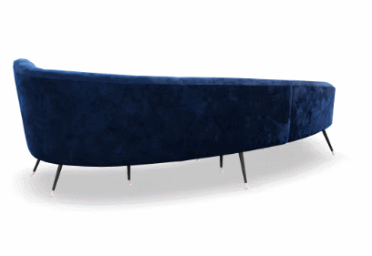

# Turntable

Create a turntable view from your GLB/GLTF model.

<p align="center">
  
</p>

 powered by [Flowkit's GLB 2 PNG](https://www.flowkit.app/glb2png)

## Demo

[Demo on CodeSandbox](https://codesandbox.io/p/sandbox/turntable-demo-vlwftg)

## Usage

### Vanilla
```html
<div
  style="max-width: 256px; margin: 0 auto"
  data-turntable-file="https://github.com/KhronosGroup/glTF-Sample-Models/raw/refs/heads/main/2.0/Avocado/glTF-Binary/Avocado.glb"
></div>

<script src="https://unpkg.com/@flwkt/turntable@0.3.0/npm/autoinit.js" />
```

### Module

1. Install from [NPM](https://www.npmjs.com/package/@flwkt/turntable) 

```bash
npm install @flwkt/turntable
```

2. Use it in your project

```html
<div
  id="your-div"
  style="max-width: 256px; margin: 0 auto"
  data-turntable-file="https://github.com/KhronosGroup/glTF-Sample-Models/raw/refs/heads/main/2.0/Avocado/glTF-Binary/Avocado.glb"
></div>
```

```js
import Turntable from '@flwkt/turntable'

const turntable = new Turntable();
turntable.init(document.querySelector('#your-div'));
```

## Protect your assets

You can use the `data-turntable-short` attribute to hide the actual path to your GLB/GLTF file to hide your 3D assets from the public.

See [data-turntable-short](#data-turntable-short) in the settings section below for more information.

## Settings

### `data-turntable-file`

The URL of the GLB/GLTF file to load.

### `data-turntable-count`

The number of images to generate from the GLB/GLTF file.

For example, if you set `data-turntable-count="14"` then the 360° view will be split into 14 images.

It's recommended to set `data-turntable-count` as small as posiible because all images need to be loaded on your users device.

Currently the maximum is 20 images.

### `data-turntable-scroll`

if `true` the turntable will rotate automatically when the user scrolls and the image is in the viewport.

### `data-turntable-lazy`

if `true` the images will be loaded lazily.

This is a beta feature right now and leads to flickering.


### `data-turntable-rv`

The vertical rotation of the images. Example: 
- `0` means the camera looks straight at the model.
- `90` means the camera looks at the model from the top.
- `-90` means the camera looks at the model from the bottom.

default is `15`.

### `data-turntable-short`

The short URL of the GLB/GLTF file to load.

This can be used to hide the actual path to your GLB/GLTF file to hide your assets from the public.

You can get the short URL from the API response of `https://www.flowkit.app/api/short?url=URL_TO_YOUR_GLB_OR_GLTF_FILE`.

For example:

https://www.flowkit.app/api/short?url=https://raw.githubusercontent.com/KhronosGroup/glTF-Sample-Models/main/2.0/Suzanne/glTF/Suzanne.gltf
